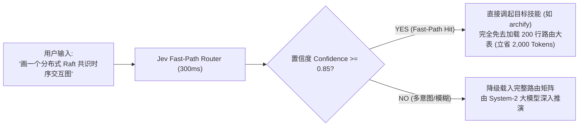

# figure-router — 统一做图路由与极速决策引擎 (Universal Figure & Diagram Router)

<div align="center">

[](LICENSE)
[](https://www.python.org/)
[](https://openrouter.ai)
[](https://agentskills.io)

**智能体通用制图与可视化总路由：覆盖科研数据图、工程架构图、学术出版示意图、演示幻灯片与 AI 生成式视觉**

[核心理念](#核心理念) • [Jev 极速快分流](#-jev-驱动的亚秒级快路径-fast-path-routing) • [六大分支总览](#六大分支路由矩阵) • [快速开始](#快速开始) • [开源标签](#github-topics--tags)

</div>

---

## 核心理念

> **能复用已有工具就不造轮子；功能相当时选更好看的；数据图必须确定性矢量渲染，AI 禁入科研数据图。**

在大语言模型与智能体生态中，用户经常提出各种形式的可视化诉求（“画个架构图”、“画个能带结构折线图”、“做个漂亮的流程时序图”）。传统 Agent 往往面临两大痛点：
1. **胡乱调用工具**：用 AI 生图模型绘制需要严格精确的科研数据曲线，或者手写易碎的临时 HTML/Canvas 胶水代码；
2. **上下文过载（Context Load 臃肿）**：维护一个包含数十种制图工具的大一统技能表，每次触发都要载入数百行规则，白白消耗大量推理 Token 与等待时间。

`figure-router` 通过**六大专业分支矩阵**与 **TypeSafe Jev 快思考决策引擎（System-1 Reflex）**，彻底实现制图意图的亚秒级精准导航与免上下文过载分发。

---

## ⚡ Jev 驱动的亚秒级快路径 (Fast-Path Routing)

本项目深度集成 **TypeSafe Jev（快思考 System-1 决策引擎）**。面对用户的自然语言做图需求，Jev 在 **300ms ~ 1,500ms** 内直接完成多分类与置信度评估：



### 一键极速选路
```bash
python3 scripts/fast_route.py -q "Nature 论文标准的声子谱与态密度数据折线图，双栏排版"
```
**毫秒级输出样例**：
```json
{
  "query": "Nature 论文标准的声子谱与态密度数据折线图，双栏排版",
  "visual_branch": "scientific_plots",
  "target_tool": "scientific_figure_making",
  "rendering_format": "vector_pdf_eps",
  "confidence": 0.97,
  "fast_path_eligible": true,
  "fast_path_action": "FAST_PATH_HIT: Directly invoke skill 'scientific_figure_making' without loading full 210-line figure-router table."
}
```

---

## 六大分支路由矩阵

| 分支序号 | 核心领域 | 首选工具 / 方案 | 典型适用场景 |
| :--- | :--- | :--- | :--- |
| **分支一** | **科研数据图表** | `matplotlib` + `SciencePlots` / `Recharts` | 顶刊学术论文（Nature/Science/IEEE）、消融对比图、能带/态密度、统计折线 |
| **分支二** | **结构图与架构图** | `archify` / `drawio-academic` / `patent-disclosure` | 交互式 HTML 架构拓扑、时序流、状态机、专利机械线稿与引出线 |
| **分支三** | **演示与汇报视觉** | `python-pptx` / `Slidev` / `Marp` | 比赛路演、技术分享 PPT、自动化幻灯片排版 |
| **分支四** | **AI 生成式视觉** | `gpt-image-prompt-engine` / `seedream` | 封面概念图、TOC 示意图、文章配图、3D 概念素材渲染 |
| **分支五** | **材料化学科学计算**| `pymatgen` / `pyvista` / `hofmann` | 晶体结构 3D 渲染、费米面、多面体拓扑、声子色散关系 |
| **分支六** | **AI 自动化图表 MCP** | `mcp-server-chart` | 自动化数据探索、单行 JSON 自动推断最优图表形态 |

---

## 路由仲裁四大铁律

1. **输出目的地优先**：
   - 论文/学术期刊投稿 $\to$ 矢量静态、确定性渲染（PDF/EPS）；
   - PPT/演示 $\to$ 矢量可编辑、可解组嵌入；
   - 网页/前端应用 $\to$ 独立交互式 SVG/HTML；
   - 概念讲解/TOC $\to$ 生成式图像（标记为 "schematic"）。
2. **复用已有优先**：已装工具与原生库能解决的问题，严禁临时手写易碎胶水脚本。
3. **美学优先**：同等功能下，优先选择排版精致、色彩协调的现代化美学引擎。
4. **期刊级硬规则**：科研数据图**严禁使用生成式 AI**，强制走确定性数值绘图脚本。

---

## 快速开始

### 1. 克隆与环境就绪
```bash
git clone https://github.com/your-username/figure-router.git
cd figure-router

# 可选：运行测试检查 Jev 决策网关连通性
python3 scripts/fast_route.py -q "测试连通性"
```

### 2. 作为 Agent Skill 挂载
本仓库符合标准 Agent Skill 规范，可直接软链接至你的 Agent 环境：
* **Claude Code**: 软链接至 `~/.claude/skills/figure-router`
* **Antigravity**: 软链接至 `~/.gemini/config/skills/figure-router`
* **OpenCode / Codex**: 软链接至 `~/.agents/skills/figure-router`

---

## GitHub Topics / Tags

为本项目在 GitHub 仓库打上以下推荐标签，便于社区检索与生态协同：

`jev` `typesafe-jev` `system-1-decision` `ai-agents` `fast-path-routing` `figure-generation` `diagram-as-code` `matplotlib` `archify` `scientific-plotting` `prompt-engineering`

---

## 开源协议

本项目基于 [MIT License](LICENSE) 协议开源。
