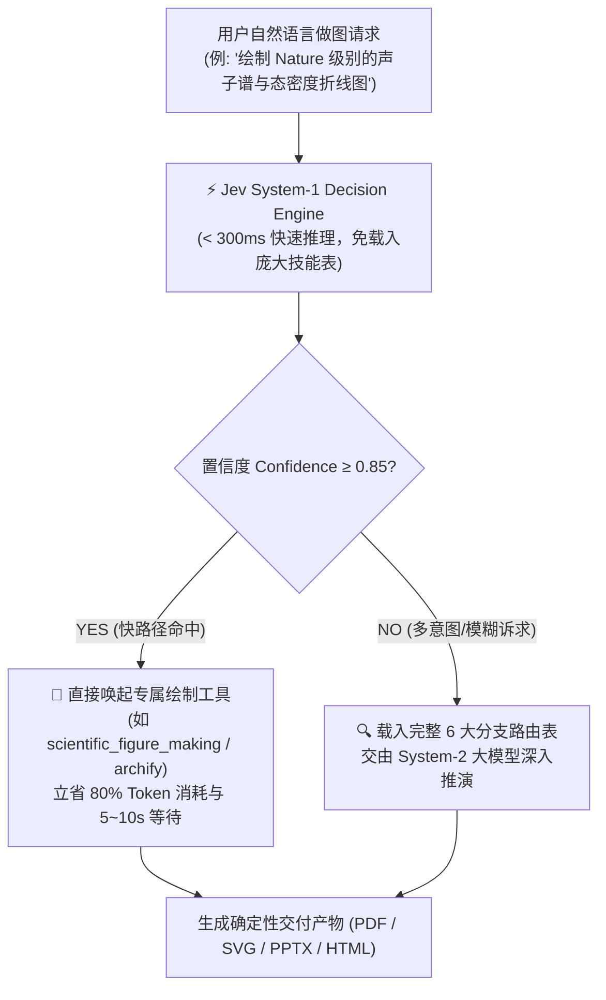

# jev-figure-router — 统一制图路由与极速决策引擎

<div align="center">

[](LICENSE)
[](https://www.python.org/)
[](https://openrouter.ai)
[](https://agentskills.io)
[](https://github.com/hoangngochuong24947-gif/jev-figure-router/pulls)

**AI Agent 通用制图与多模态可视化总路由：毫秒级意图决策 + 六大多模态渲染分支**  
涵盖顶刊学术数据图、系统架构拓扑图、交互式矢量 SVG、演示汇报幻灯片、材料计算 3D 渲染与 AI 概念生成。

[核心理念](#-核心理念) • [Jev 极速快决策](#-jev-极速决策引擎-system-1-reflex) • [60秒极速上手](#-60-秒极速上手-quickstart) • [六大分支渲染矩阵](#-六大分支渲染矩阵) • [Agent 集成指南](#-ai-agent-生态集成) • [可运行示例](#-可运行工程示例-examples)

</div>

---

## 💡 核心理念

> **能复用已有工具就不造轮子；功能相当时选更好看的；数据图必须确定性矢量渲染，AI 严禁入科研数据图。**

在以大语言模型（LLM）为核心的 Agent 工作流中，可视化绘图一直是高频且容易翻车的场景（“帮我画个系统架构图”、“帮我绘制钙钛矿能带与声子态密度图”、“制作商业汇报 PPT 架构页”）。传统 AI 绘图经常面临两大**致命顽疾**：

1. **调用错乱与伪随机幻觉**：
   - 用 DALL-E / Midjourney 等生成式模型去画必须严谨无误的科研实验曲线，导致坐标轴和数据完全捏造；
   - 随手写一堆临时易碎的 HTML/Canvas 胶水代码，缺少交互、难于二次编辑与工程交付。
2. **上下文过载与推理膨胀（Context Load Bloat）**：
   - 为了让 Agent 学会多种绘图工具，很多团队把几十个工具的 Prompt 和参数表全部塞进系统提示词，导致 Agent 每次画图都要载入上千行上下文，白白消耗数千 Token 且延迟高达 10 秒以上。

`jev-figure-router` 融合 **TypeSafe Jev 快思考决策引擎（System-1 Reflex）** 与 **六大多模态专业渲染分支**，实现 **< 300ms** 的语义快分流，直接锁定精准工具并生成生产级起始代码！

---

## ⚡ Jev 极速决策引擎 (System-1 Reflex)

传统大模型（GPT-4 / Claude / DeepSeek）擅长复杂的深度逻辑推演（System-2），但用于简单的工具分类时**过于笨重缓慢**。

本项目引入 **TypeSafe Jev 决策协议**，将用户自然语言请求投递至专用的极速端点，在 **300ms ~ 1,000ms** 内输出带有置信度与渲染规范的强类型结构化仲裁：



---

## 🚀 60 秒极速上手 (Quickstart)

### 1. 克隆与一键安装

本项目提供一键安装脚本 `install.sh`，自动检测 Python 环境、安装可视化依赖，并自动软链接至您已有的 Agent 环境：

```bash
git clone https://github.com/hoangngochuong24947-gif/jev-figure-router.git
cd jev-figure-router

# 运行一键配置（可选加 --venv 自动创建虚拟环境）
chmod +x install.sh
./install.sh
```

或者手动通过 pip 安装依赖：
```bash
pip install -r requirements.txt
```

### 2. 配置密钥

本项目具备**零依赖自愈能力**：
- **方案 A（推荐，极简）**：设置 OpenRouter API Key，脚本将通过 Python 原生 HTTP 库调用 Jev 端点，无需本地编译任何 CLI：
  ```bash
  export OPENROUTER_API_KEY="sk-or-v1-..."
  # 或者直接写入项目根目录下的 .env 文件
  ```
- **方案 B**：如果你已安装本地 `jev` 命令行工具，脚本将自动检测并复用。

### 3. 运行极速路由与模板生成

```bash
# 1. 极速测试路由并生成科研折线图模板
python3 scripts/fast_route.py -q "Nature 论文标准的声子谱与态密度数据折线图，双栏排版" --template

# 2. 路由架构拓扑并获取纯 JSON
python3 scripts/fast_route.py -q "基于 Raft 共识算法的分布式日志同步时序图" --json
```

**毫秒级输出示例**：
```json
{
  "query": "Nature 论文标准的声子谱与态密度数据折线图，双栏排版",
  "visual_branch": "scientific_plots",
  "target_tool": "scientific_figure_making",
  "rendering_format": "vector_pdf_eps",
  "confidence": 0.98,
  "fast_path_eligible": true,
  "fast_path_action": "FAST_PATH_HIT: Directly invoke skill 'scientific_figure_making' without loading full router table."
}
```

---

## 📊 六大分支渲染矩阵

| 分支序号 | 核心领域 | 首选工具 / 方案 | 交付物格式 | 典型适用场景 |
| :--- | :--- | :--- | :--- | :--- |
| **分支一** | **科研数据图表** | `matplotlib` + `SciencePlots` | 矢量 PDF / EPS | 顶刊学术论文（Nature/Science/IEEE）、消融实验对比、能带结构、态密度、统计箱线图 |
| **分支二** | **结构图与架构图** | `archify` / `drawio-academic` | 交互式 HTML / SVG | 交互式微服务拓扑、Raft 时序流、状态机、专利机械线稿与附图序号引出 |
| **分支三** | **演示与汇报视觉** | `python-pptx` / `Slidev` / `Marp` | `.pptx` / HTML Slides | 科技立项答辩、商业路演 Pitch Deck、团队分享幻灯片矢量图形排版 |
| **分支四** | **AI 生成式视觉** | `gpt-image-prompt-engine` / `seedream` | 高清 PNG / WebP | 论文封面概念图（Cover Art）、TOC 示意图、公众号科技配图、3D 素材渲染 |
| **分支五** | **材料化学科学计算**| `pymatgen` / `pyvista` / `hofmann` | 矢量图 / 3D HTML | 晶体结构 3D 渲染、第一性原理费米面、多面体配位几何拓扑 |
| **分支六** | **自动化图表 MCP** | `mcp-server-chart` | 动态图表组件 | 自动化数据探索、单行 JSON 自动推断最优可视化形态 |

### 路由四大仲裁军规

1. **输出目的地优先**：
   - 投递期刊论文 $\to$ 强制矢量静态、确定性数值绘图（PDF/EPS）；
   - 演示汇报 $\to$ 矢量可解组 PPTX，支持二次编辑；
   - Web / 移动端 $\to$ 独立响应式 SVG/HTML。
2. **复用已有优先**：已装工具与原生库能解决的问题，严禁手写脆弱的胶水脚本。
3. **美学优先**：同等功能下，优先选择排版精致、色彩科学（Colorblind-safe）的现代美学方案。
4. **期刊级硬门禁**：科研数据图**严禁使用生成式 AI**，杜绝任何学术不端与数据虚构。

---

## 🎨 可运行工程示例 (Examples)

本项目在 `examples/` 目录下提供了完整的开箱即用代码示例：

### 1. 顶刊学术论文折线图 (`examples/demo_scientific_plot.py`)
直接运行生成符合 Nature / Science 规范的双栏矢量图（自动适配 SciencePlots 顶刊主题，缺失时自动优雅降级）：
```bash
python3 examples/demo_scientific_plot.py
# 产物：
# - examples/nature_publication_demo.pdf (可直接导入 LaTeX 编译的矢量文件)
# - examples/nature_publication_demo.png (300 DPI 高清预览图)
```

### 2. 现代暗黑风交互式架构图 (`examples/demo_architecture_diagram.html`)
展示 Jev 路由架构的交互式独立 HTML/SVG 图，内置发光微动效与响应式排版：
```bash
open examples/demo_architecture_diagram.html
```

### 3. 代码中调用 Jev 路由 SDK (`examples/quickstart_routing.py`)
演示在 Python 脚本或后台服务中直接嵌入 Jev 快路径分类器：
```bash
python3 examples/quickstart_routing.py
```

---

## 🤖 AI Agent 生态集成

本项目符合开源 [Agent Skills](https://agentskills.io) 开放规范，可直接接入主流 AI 编程助手与 Agent 运行时：

### 1. Claude Code
```bash
ln -s "$(pwd)" ~/.claude/skills/figure-router
```

### 2. Antigravity (Google DeepMind)
```bash
ln -s "$(pwd)" ~/.gemini/config/skills/figure-router
```

### 3. OpenCode / Codex / Cursor
```bash
ln -s "$(pwd)" ~/.agents/skills/figure-router
```

挂载完成后，Agent 在收到绘图需求时，会首先在内部执行 `python3 scripts/fast_route.py` 进行 300ms 快速判断，直接命中专精分支，无需反复翻阅庞大的规则手册！

---

## 📂 仓库结构

```
jev-figure-router/
├── install.sh                  # 一键环境配置与 Agent 自动挂载脚本
├── requirements.txt            # 核心数据可视化与矢量图依赖
├── README.md                   # 本说明文档
├── SKILL.md                    # Agent Skill 规范标准说明与路由定义
├── REGISTRY.md                 # 完备工具注册总表与参数规范
├── LICENSE                     # MIT 开源许可证
├── scripts/
│   └── fast_route.py           # Jev System-1 毫秒级语义快路由脚本 (支持原生 HTTP 自愈)
└── examples/
    ├── demo_scientific_plot.py          # Nature 风格双栏矢量科研图生成示例
    ├── demo_architecture_diagram.html   # 独立交互式暗黑系系统架构图 (HTML/SVG)
    └── quickstart_routing.py            # Python 调用 Jev 路由引擎快速演示
```

---

## 🏷️ GitHub Topics & Tags

`jev` `jeb` `typesafe-jev` `system-1-decision` `ai-agents` `fast-path-routing` `figure-generation` `diagram-as-code` `matplotlib` `archify` `scientific-plotting` `prompt-engineering`

---

## 📄 开源协议

本项目采用 [MIT License](LICENSE) 许可协议。欢迎提交 Issue 与 Pull Request！
