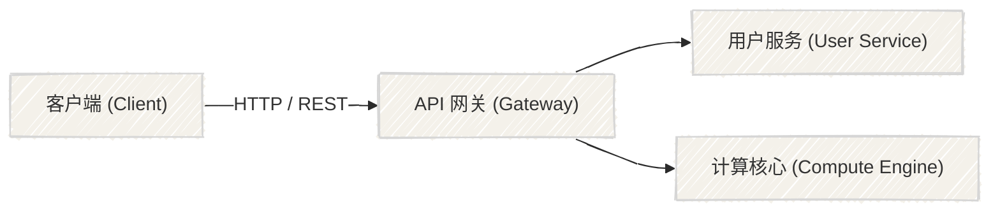

# 手绘风图表系统与配置规范 (Hand-Drawn / Handraw Style Guide)

> **定位**: `figure-router` 分支二（结构图/示意图）与分支一（手绘数据图）的专属手绘风格（Handraw Style）实施规范。
> **适用场景**: 概念讲解、技术草图、架构科普、教学讲义、产品原型、非严肃性汇报。
> ⚠️ **红线禁令**: **学术期刊 Nature/PNAS/NPJ 等正式实验数据图严禁使用手绘风**（保持确定性矢量渲染与严谨性）；手绘风仅用于概念机制示意图（需标注 "schematic"）。

---

## 一、 手绘风全系技术栈选型矩阵

根据**输出目的地**与**交互需求**，按表精准选型，杜绝工具滥用：

| 交付形式 / 目标 | 首选方案 | 核心技术 / 机制 | 特性与优势 | 产物形态 |
| :--- | :--- | :--- | :--- | :--- |
| **文档内嵌快速手绘图** | **Mermaid (handDrawn)** | `look: handDrawn` (v10.7+) | 零依赖、GitHub / Obsidian 原生渲染、纯 Markdown | Markdown 块 |
| **可编辑架构/工程图** | **draw.io (Rough/Comic)** | `sketch=1; rough=1;` | 内置 rough.js 引擎、可二次拖拽编辑、300dpi 导出 | `.drawio`, SVG, PNG |
| **现代架构图 DSL** | **D2 (Sketch)** | `vars: { d2-config: { sketch: true } }` | 声明式代码排版、自适应布局、美学优于 Mermaid | SVG, PNG |
| **白板/原型协同图** | **Excalidraw** | Excalidraw JSON / Virtual Canvas | 极佳的手绘笔触质感、无限画布、团队协同 | `.excalidraw`, SVG |
| **程序化批量/组件级 SVG** | **Rough.js (本地克隆)** | `~/Documents/projects/rough` | 原生 Canvas/SVG 生成、<9KB 轻量、完全参数可控 | SVG 文件, JS 嵌入 |
| **手绘风统计数据图** | **rough-viz** / **DrawCharts** | D3 + Rough.js 封装 | 赋予柱状图/圆环图/饼图手绘涂鸦质感 | 交互 HTML, SVG |

---

## 二、 核心方案硬性参数与标准代码片段 (Hard Parameters & Snippets)

### 1. Mermaid 手绘模式 (Mermaid `handDrawn`)
在 Mermaid 图表定义首行注入初始化配置：



### 2. draw.io 手绘草图模式 (Rough & Comic Style)
draw.io 自带基于 Rough.js 的手绘模式，支持节点级与全图级参数定制：

#### (1) 全图开启手绘参数
- **Web URL 参数**: 在打开或导出链接追加 `&sketch=1&rough=1`；
- **XML 属性**: 在 `<mxGraphModel>` 下添加全局样式声明。

#### (2) 节点与连线核心物理参数表 (Hard Parameters)
| 属性名 (Property) | 类型 | 推荐取值 | 视觉效果与说明 |
| :--- | :--- | :--- | :--- |
| `sketch` | boolean | `1` | 开启草图手绘总开关 |
| `sketchStyle` | string | `rough` 或 `comic` | `rough` 笔触粗犷真实；`comic` 较为平缓克制 |
| `jiggle` | number | `1.5` ~ `3.0` | 抖动幅度（数值越大线条越曲折不规则） |
| `fillWeight` | number | `1.0` ~ `2.5` | 内部涂鸦画笔粗细（笔触厚度） |
| `hachureGap` | number | `3` ~ `6` | 阴影线间距（数值越小填充越密实） |
| `hachureAngle` | number | `-45` 或 `45` | 阴影排线角度（度数） |
| `disableMultiStroke`| boolean | `0` 或 `1` | `0` 允许多次重复起笔草绘；`1` 保持单笔线 |

#### (3) 节点 XML 样本片段
```xml
<mxCell id="2" value="认证网关" style="rounded=1;whiteSpace=wrap;html=1;sketch=1;sketchStyle=rough;jiggle=2;hachureGap=4;hachureAngle=-45;fillColor=#dae8fc;strokeColor=#6c8ebf;" vertex="1" parent="1">
  <mxGeometry x="160" y="120" width="120" height="60" as="geometry"/>
</mxCell>
```

---

### 3. D2 手绘架构图 (D2 Sketch Mode)
在 D2 脚本中注入全局配置变量：

```d2
vars: {
  d2-config: {
    sketch: true
    theme-id: 300 # 手绘友好暖色主题 (Grape)
  }
}

client: "客户端 App" {
  shape: person
}

gateway: "边缘代理\n(Edge Gateway)" {
  style.fill: "#f8f9fa"
}

db: "分布式数据库" {
  shape: cylinder
}

client -> gateway -> db: "SQL 查询"
```

---

### 4. Rough.js 编程级 SVG 生成 (本地克隆库直调)
代码位于本地沙盒 `~/Documents/projects/rough`。

#### (1) 基础调用范例 (Node.js / 浏览器 SVG 模式)
```javascript
const rough = require('roughjs');
// 假定已有 SVG 容器节点 document.getElementById('svg-canvas')
const rc = rough.svg(svgNode);

// 1. 绘制手绘矩形 (x, y, width, height, options)
const rect = rc.rectangle(20, 20, 180, 80, {
  roughness: 2.2,       // 粗糙度 (默认 1)
  bowing: 1.5,          // 弯曲度 (默认 1)
  fill: '#ffc107',      // 填充色
  fillStyle: 'zigzag',  // 填充样式: hachure | zigzag | cross-hatch | dots | dashed
  fillWeight: 2,        // 填充画笔宽度
  hachureAngle: 60,     // 阴影线角度
  hachureGap: 5,        // 阴影线间隙
  stroke: '#212529',    // 边框色
  strokeWidth: 2        // 边框宽度
});
svgNode.appendChild(rect);

// 2. 绘制手绘带箭头连线
const line = rc.line(200, 60, 360, 60, {
  roughness: 1.8,
  stroke: '#495057',
  strokeWidth: 2
});
svgNode.appendChild(line);
```

#### (2) 填充样式 (`fillStyle`) 选项表
- `hachure`（默认斜线条平行阴影）
- `cross-hatch`（交叉网格阴影，适合强调与密集节点）
- `zigzag`（Z 字折叠画笔，手工涂鸦质感极强）
- `dots`（点阵填充，适合柔和过渡）
- `dashed`（虚线草图排线）

---

## 三、 手绘风配色规范 (Handraw Palette)

手绘草图最忌讳刺眼的纯霓虹原色（如 `#FF0000`, `#00FF00`），推荐使用**低饱和度暖调水彩/莫兰迪手绘色系**：

| 语义角色 | 推荐色值 | 视觉名称 | 适用构件 |
| :--- | :--- | :--- | :--- |
| **画布背景** | `#fdfbf7` 或 `#f7f4ee` | 羊皮纸 / 复古暖白 | 整体背景，营造自然纸张底噪 |
| **墨水线条** | `#2b2b2b` 或 `#343a40` | 铅墨炭黑 | 节点外框、流程连线、手写文字 |
| **主调强调** | `#4a90e2` / `#6c8ebf` | 浅墨水蓝 | 核心服务节点、请求起点 |
| **次调成功** | `#82c91e` / `#b5e7a0` | 鼠尾草绿 | 存储、成功分支、缓存 |
| **警示高亮** | `#ffa94d` / `#ffc078` | 杏黄暖橙 | 外部 API、网关拦截、待定事项 |
| **异常分支** | `#ff8787` / `#f08080` | 浅砖绯红 | 熔断节点、错误重试、告警逻辑 |

---

## 四、 质量验收与检查清单 (Quality Gate)

在交付手绘风格图表前，检查以下 4 项指标：
- [ ] **场景合规**：确认需求非正式期刊实测数据图（严禁污染学术严肃性）；
- [ ] **线条防死板**：确认已配置 `jiggle` 或 `roughness`，避免线条出现绝对笔直的机械感；
- [ ] **填充无溢出**：若节点文字较多，确认手绘排线（hachure）未过密遮挡文字；
- [ ] **文字字体协调**：若支持自定义字体，建议绑定手写或无衬线手写感字体（如 `Caveat`, `Comic Neue`, `Patrick Hand` 或无衬线体 `Inter`），避免使用死板的 Times New Roman 或宋体。
